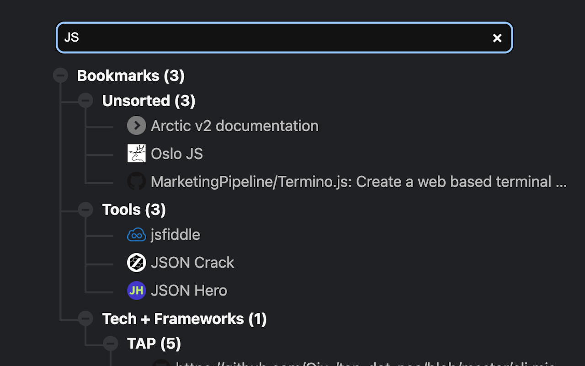

# Tiny Bookmark Tab

Display browser bookmarks in a tree-list. Fast.

[Firefox Install](https://addons.mozilla.org/en-US/firefox/addon/tiny-bookmark-tab/)

[Chrome Install](https://chrome.google.com/webstore/detail/tiny-bookmark-tab/miihjlhjnppilabnfhpoglmldbkjglcc)

<small>Extension icon from [vmware/clarity](https://github.com/vmware/clarity).</small>

<small>Tree CSS from [Kate Rose Morley](https://iamkate.com/code/tree-views/).</small>

## Screenshots

Automatic dark mode

## Development

There's an index.html and assets/tiny.js - two files. The way Tim intended.

## Release

Create .zip with `assets/`, `manifest.json`, and `tiny.html`.  
Update screenshots if needed.
